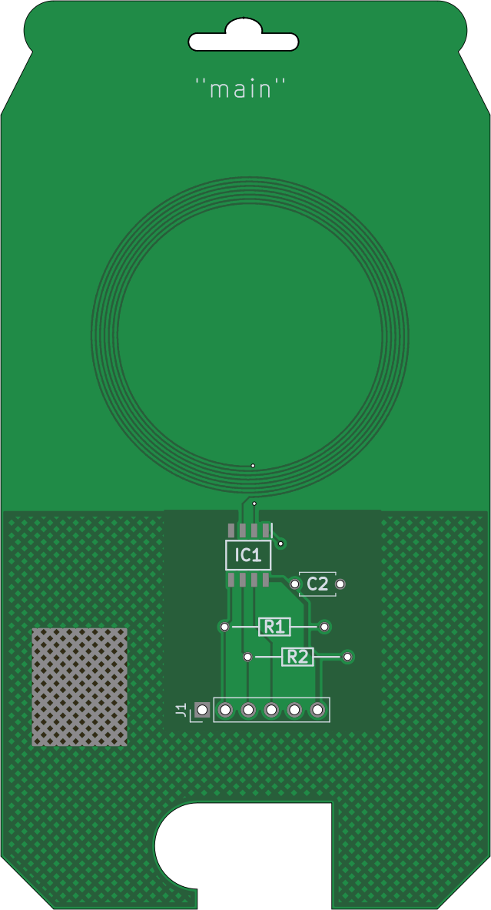

# Carolinacon Face Reveal:

# Carolinacon 19 Badge

# Legally Required Credits

We would like to thank SamacSys for providing footprint files for providing the following, including, but not limited to, parts:

 - `OS102011MA1QN1`

Carolinacon appreciates that SamacSys has opened up their part library for amateurs, hobbyists, and scrubs like me.

# Miscellaneous Legal Disclaimers

The Carolinacon Conference is operated, and originally conceived of, by ChatGPT.

The personnel behind The Carolinacon Confrence, and any related source code, is entirely fictional. 
